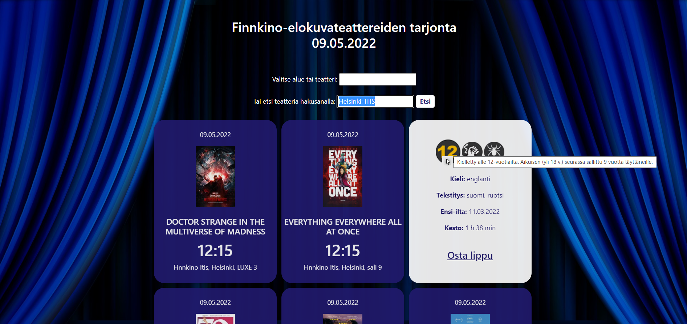

# Cinema Information App 2.0

## Project Description
Project 3 for *Dynamic Web Applications with JavaScript* course (Laurea UAS 5 ects). The aim was to redo a previously made app, now using jQuery. This is an improved version of my [Cinema Information App](https://github.com/mee-ri/cinema-information-app).

#### Requirements
- DOM scripting and AJAX calls made with jQuery
- Some jQuery effects used (e.g. fadeIn(), fadeOut(), animate())
- Layout stylized with a component library (e.g. Bootstrap)
- JavaScript and CSS kept in external files
- Code is formatted and commented

## Features  
 :abc: User can choose an area or a specific cinema from a drop-down menu that lists the predefined options based on the user's data input   
 :mag_right: User can choose an area or a specific cinema by using custom search string field  
 :star: Search field recognizes some popular nicknames used for cinemas (such as *"Tennari"* for Helsinki Tennispalatsi or *"Omppu"* for Espoo Omena)  
 :exclamation: Empty or incorrect searches fire an alert box  
 :ticket: After a cinema has been successfully chosen, flippable schedule cards will be smoothly faded in (500 ms) with the following data:  
 **front**: date, an image of the movie poster, movie title, starting time, and auditorium details  
 **back**: age rating, content descriptors, language, subtitle languages, premier date, and duration  
 :eyes: Age rating and content descriptor images are enlargened when user hovers mouse over them  
 :bookmark: Tooltips are attached to age rating and content descriptor images  
 :white_flag: In case there are no shows on the current date, user is informed by an alert box  
 :heavy_plus_sign: Clicking on the call-to-action *Osta lippu* opens a link to the movie's synopsis page on Finnkino in a new tab  
 :top: "Scroll to top" button is smoothly faded in (1000 ms) and becomes clickable when the user scrolls down 20px from the top of the document. Button is faded out (500 ms) on the reverse action.

## How to Run
This application is published in Netlify: https://gleaming-lokum-242fa7.netlify.app/

## Technologies
- JavaScript
- HTML
- CSS

## Reflection
